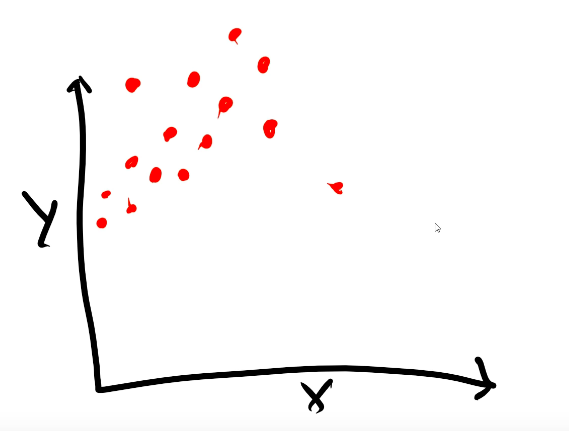
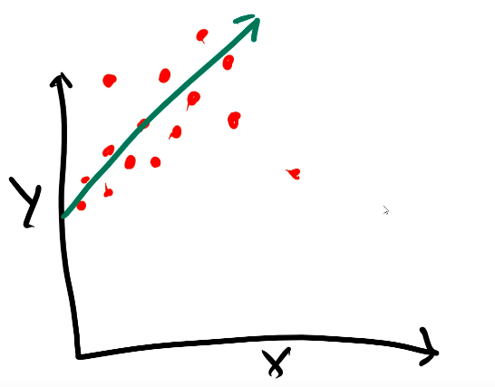
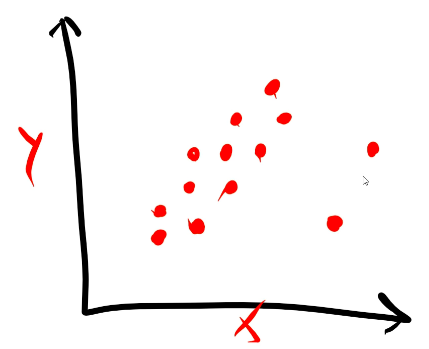
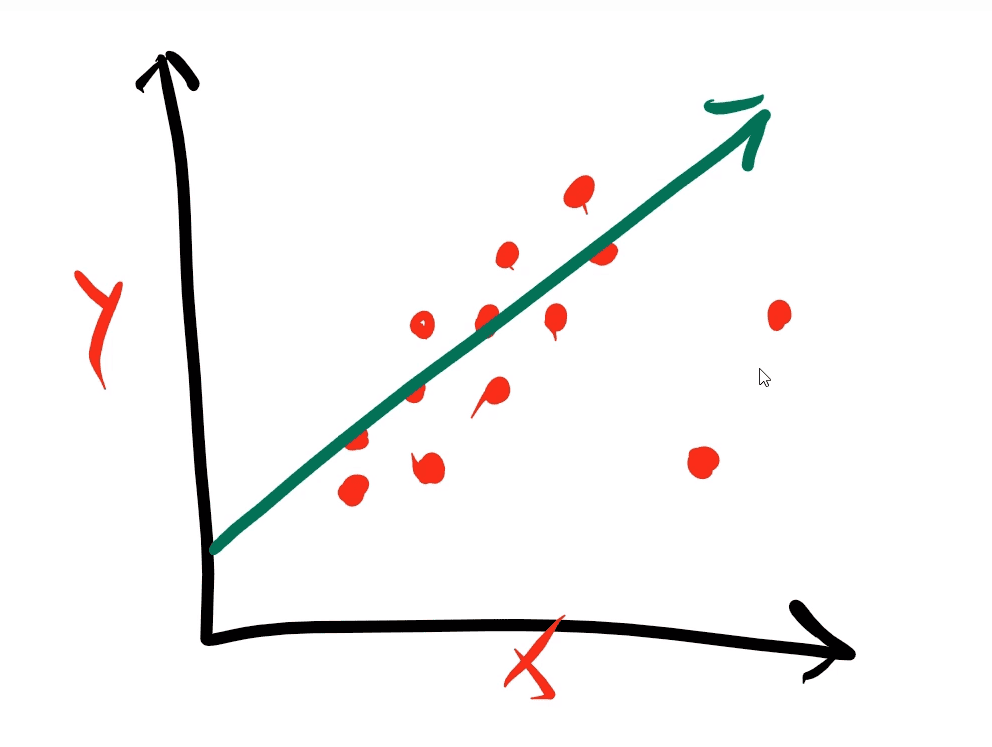

- Used to sort of, predict values
- Is effective only when we are using data that correlates. So it wont work on random data
- It only works on integers

Linear regression is a statistical method used to understand and predict the relationship between two variables. It assumes that there's a linear relationship between the independent variable (the one you control or measure) and the dependent variable (the one you're trying to predict). Basically, it's like drawing a straight line through a cloud of data points to capture the general trend. This line helps us make predictions about one variable based on the other. This line is known as the "best fit line", the "Y hat line", or the "regression line"


<br><br><br>


# Attributes vs Label

Attributes/Features are all the sort of columns or things whose values we are gonna use to predict stuff (so in our project, it will be previous grades, study time, failures, and absences). The things we will be predicting are called "labels" (which will be the final grade, aka G3, in our project)


<br><br><br>


# Best fit line / Regression line / Y hat line

"Best fit line" is like, a straight line drawn thro the densest data points plotted in a scatter plot

Suppose that we have the x axis as our attribute, and the y axis as our label. We are gonna create a scatter plot, and then attempt to draw a straight line through the most densely populated area of the graph. The line we are gonna end up with will be called the "best fit line", and its formula (something like y = m𝑥+b) will be used to predict the value of `y` when `𝑥` is given

This line can be defined as $y = mx+b$, where $m$ is the slope (how do changes in $x$ change $y$). It can be +ve or -ve. +ve means that as $x$ increases, $y$ also increases. And -ve means that as $x$ increases, $y$ decreases). Linear regression basically predicts this line and then gets the value of label(ie $y$) by taking in attribute(s) (ie $x$). In real life situations, this best fit line is made in a multi-dimensional space (no. of dimensions = no. of attributes + no. of labels). In the equation, $b$ is called the "intercept" because its where the line intercepts the y axis, ie the value of $y$ when $x$ is 0

So in a diagram like



The best fit line would look something like



One more example:




<!--  -->


<br><br><br>


# Calculating coeff and intercept for 2D

The formula for a line is $y = mx+b$. So to calculate the best fit line, the formula of the slope ($m$) and the intercept ($b$) is:

$$m = \frac { \overline{x}\cdot\overline{y} - \overline{xy}  } { (\overline{x})^2 - \overline{x^2} }$$

$$b = \overline{y} - m \cdot \overline{x}$$

where the overlines represent mean


<br><br><br>


# Error metrics
hat means the predicted $y$ value, and overline represents the mean

<br>

### 1) MSE (Mean Squared Error)

$$MSE = \frac{1} {n} \displaystyle\sum_{i=1}^n (y_i - \hat{y})^2$$

<br>

### 2) R^2^ (R-squared error), aka coefficient of determination

Here SSR stands for "Sum of Squared Residuals", and SST stands for "Total Sum of Squares". SSR is also known as RSS (Residual Sum Squared) and SST is also known as TSS (Total Sum Squared)

- R-squared values range from 0 to 1, usually expressed as a percentage from 0% to 100%.
- This value of R square tells you how well the data fits the line you’ve drawn.
- The higher the model’s R-Squared value, the better the regression line fits the data
- R-squared values very close to 1 are likely overfitting of the model and should be avoided
- So if the model value is close to 0, then the model is not a good fit 
- A good model should have an R-squared greater than 0.8
- We square error values to:
  - Make sure all values are positive, so that negative and positive errors dont cancel each other out
  - Heavily penalise outliers

$$R^2 = 1-SSR/SST$$

$$SSR (aka\space RSS) = \textstyle\sum_{i=1}^n (y_i - \hat{y})^2$$

$$SST (aka\space TSS) = \textstyle\sum_{i=1}^n (y_i - \overline{y})^2$$


<br><br><br>


# Polynomial regression

Basically, here rather than the best fit line being straight, it will curved, since the degree of its equation will not be one. For example, suppose we have a case where our label is `y` and features are x~1~ and x~2~. So for polynomial regression, the equation of the best fit line could be something like:

y = ax~1~ + bx~2~ + cx~1~^2^
or
y = ax~1~ + bx~2~ + cx~1~x~2~
(a,b,c are constants)

<br>

The higher the degree of a polynomial regression, the more complex the model (lower bias, higher variance). At lower degrees, we can see visual sign of bias. At higher degrees, we can see visual signs of variance. For eg:

<br>

<center>

</center>

<br>

To perform this, we just transform the matrix/dataframe of the X values to include columns that have values of the features to various powers (using `sklearn.preprocessing.PolynomialFeatures`). The math of regression will then find out the importance of feature/column. So for example, if we have a dataframe of features like:

| a | b |
| - | - |
| 7 | 2 |
| 5 | 1 |
| 9 | 4 |

If we transform it (with the highest degree being 3), it will look like:

| a | b | a^2^ | a^3^ | b^2^ | b^3^ |
| - | - | ---- | ---- | ---- | ---- |
| 7 | 2 |  49  |  343 |   4  |   8  |
| 5 | 1 |  25  |  125 |   1  |   1  |
| 9 | 4 |  81  |  729 |  16  |  64  |


<br><br><br>


# Regularisation

Feature selection is important because reducing the number of features can prevent overfitting. For some models, fewer features can improve fitting time and/or results. Also identifying most critical features can improve model interpretability

Regularisation performs feature selection by shrinking the contribution of features. For L1 (lasso) regularisation, this is accomplished by driving some coeffs to 0

Adjusted cost function:

M(w) + λR(w)

where
M(w): model error
R(w): function of estimated parameters
λ: Regularisation strength parameter

The λ is gonna add a "penalty" proportional to the size of the estimated model parameter, or a function of the parameter

More regularisation introduces a simpler model or more bias, while less regularisation makes the model more complex and increases variance

Increasing L1 and L2 penalties force coeffs to be smaller, restricting their plausible range. A smaller range for coeffs must be simpler or have a lower variance than a model with infinite possible coeff range

(Preventing underfitting and overfitting)

<center>

</center>

<br>

### Ridge regression (L2)

- The complexity penalty (λ) is applied proportionally to squared coeff values
- The imposes bias but reduces variance
- We can select the best regularisation strength lambda via cross validation
- Its best practice to scale features (ie using `StandardScaler`) so penalties aren't impacted by variable scale

### Lasso regression (L1)

- LASSO stands for least absolute shrinkage and selection operator
- The complexity penalty (λ) is applied proportionally to absolute coeff values
- LASSO is more likely to perform feature selection, meaning it is more likely to result in coeffs being set to 0
- Slower to converge than ridge regression

<center>


</center>

<br>

### Elastic Net

- It is a mix between L1 and L2 regression, aka a hybrid approach
- It introduces a new variable, ie α. It determines the weighted average of L1 and L2 penalties
- It combines penalties from LASSO and ridge regression

<center>

</center>


<br><br><br>


# RFE (Recursive Feature Elimination)

It is a feature selection technique. It is also provided by sklearn. It goes as follows:
- We will choose the model which will be trained on the data
- We will specify the number of features we want to end up with
- RFE then repeatedly applies the model, measures feature's importance, and recursively removes less important features

```py
from sklearn.feature_selection import RFE
rfeMod = RFE(est, n_features_to_select=n) # est is instance of model
rfeMod.fit(X_train, Y_train)
Y_pred = rfeMod.predict(X_test)
```

The `RFECV` class will perform feature elimination using cross validation
