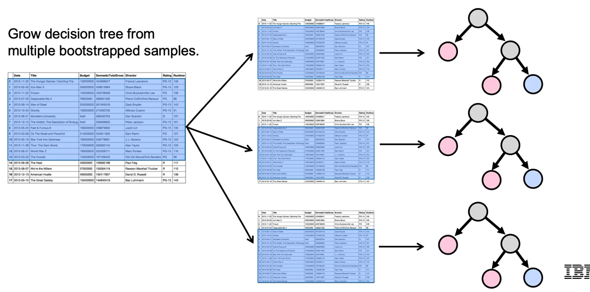

- It basically is to create a classification model which leverages multiple classification algorithms
- Bagging = bootstrap aggregating
- In bagging, `oob_score_` (out of bag error) is the standard error metric to compare different ensemble models (like RF and extra-trees)
- In bagging, `model.feature_importances_` ?

   

# Bagging (bootstrap aggregating) w/ decision trees

Decision trees can have high variance and tend to overfit. To reduce variance, we can train multiple different independent decision trees on different rows of the same data (some rows can overlap) so that they would have slightly different structures, and then have them vote on what class they think should be predicted. So for example, it could look something like this (squares below the bar are final decisions, made based on votes of all the decision trees)

Like decision trees, these models are easy to interpret and heterogenous input data is allowed, meaning no preprocessing is required
Unlike decision trees, these models have less variance and can grow trees in parallel

Main objective of bagging is to reduce variance

 

### How many trees to fit?

The more the number of trees, the less the overfitting. In practical bagging, theres a point of diminishing returns, which is usually ~50 trees

 

### Random forest

- For `n` ++independent trees++ each with variance σ^2^, the bagged variance is σ^2^/n. But in reality, the trees are not independent. Since we are sampling with replacement, they are likely to be very highly correlated. [pσ^2^ + σ^2^(1-p)/n] If the correlation is close to 1, we end up with no reduction in variance. So to solve this problem, we introduce randomness and ensure that every tree is significantly different from each other, and thus de-correlated. To achieve this, we restrict the number of features the trees are allowed to be build from. So that all trees will not just be trained on different rows, but different columns as well
- If `n` is the number of features, it is recommended to use root(n) features in classification and n/3 features in regression
- The resulting algorithm is known as random forest

 

### Extra (random) trees
- However, there are some cases when random forest doesn't reduce error. Sometimes, random forests can overfit, and we can introduce even more fucking randomness to solve that. To add more randomness, we can create splits in the decision trees randomly instead of greedily. These trees we end up with are called "Extra Random Trees"

   

# Boosting
Has a higher chance (than bagging) to overfit

Suppose we want to make a classifier which combines 3 decision trees which are "weak learners" (ie have only one condition), what we do is we let the first tree make the greedy split, now the next tree will give more preference/weight (ie prefer them more than the ohers and try to classify them correctly harder than how much it would try to correctly classify other points) to those points which were misclassified by the first tree, and the third tree will give more preference to he points misclassified by the second tree, so the boosting model will look something like:

 

### Learning rate

Represented by λ. Basically defines how much weight to be provided to each successive decision tree, or how much we will allow each step to move towards correcting the prior trees. We should have more trees if we are working with a lower learning rate. If we have a high learning rate, we can easily overfit. Its recommended to set is value to <1

 

### Loss function
- Boosting utilises different loss functions
- At each stage, the margin is determined for each point
- Margin is +ve for correctly classified points and -ve for misclassifications
- Value of loss function is calculated from margin

Various loss functions are:

**1) 0-1 loss function**
This is the most frequently discusses loss function. It basically returns 1 for incorrectly classified points and ignores correctly classified points. This is a "theoretical loss function" because its actually rarely used. That is cause this function is not differentiable, and a function like this one (which is non-smooth and non-convex) is difficult to optimise

**2) Adaboost (Adaptive Boosting) loss function**
This loss function is exponential (ie e^-margin^). Very negative points can strongly affect the loss, so if the distance from our margin is large and incorrect, we end up with a large contribution to the overall error for that given point. Thus, adaboost is very sensitive to outliers

**3) Gradient boosting loss function**
It is a generalised boosting method that can use different loss functions. Common implementation of this uses log(1 + e^-margin^). This loss function is more robust to outliers

   

# Bagging vs boosting

| Bagging | Boosting |
| ------- | -------- |
| Models are trained on subsets (bootstrapped samples) of the data | Models are trained on the entirety of the data |
| Base learners (trees) are independent from one another and are usually full trees | Base learners (trees) are weak learners and created successively, meaning that each learner builds on top of the previous steps |
| Only data of the bootstrap samples is taken into account | The whole dataset as well as residuals from previous models are taken into account |
| No weighing used, all data points are treated equally | Misclassified data points are weighed more, ie given more preference and importance to get correctly classified |
| Excess trees will not overfit | We have to beware of overfitting |

   

# Tuning a gradient boosted model

   

# Stacking

Models of ANY kind can be combined to create a stacked model. The idea is to fit several algorithms to our training set and use their predictions or their scores of each of these individual base learners as a new training set. These become our "meta features" (each one of the outputs of each one of these base learners) and then we pass them through to one final classifier called the "meta classifier" to come up with a single prediction

It is like bagging but is not limited to decision trees

Such models can become very complex very quickly, and thus can overfit very easily

For the meta classifier, we can just use the voting method like we did in bagging, or use a classification model

